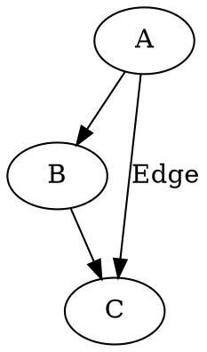

# Visualizing Graphs with Graphviz

## Introduction
Graphviz is an open-source graph visualization tool that allows users to create structured diagrams using a simple textual language called DOT. It is widely used in various domains, including software engineering, network analysis, and data science, to represent relationships in an intuitive manner.

## Installation & Setup
Graphviz can be installed on multiple platforms.

### Installing Graphviz
#### Windows:
1. Download the installer from [Graphviz.org](https://graphviz.org/download/).
2. Run the installer and follow the setup instructions.
3. Add Graphviz to the system PATH for command-line usage.

#### macOS:
```sh
brew install graphviz
```

#### Linux (Ubuntu/Debian):
```sh
sudo apt install graphviz
```

### Installing the Python Library
For programmatic usage in Python, install the `graphviz` package:
```sh
pip install graphviz
```

## Key Features & Explanation
Graphviz provides the following key features:
- **DOT Language**: A simple, human-readable format for defining graphs.
- **Multiple Layout Engines**: `dot`, `neato`, `fdp`, `sfdp`, and more for different graph layouts.
- **Custom Styling**: Nodes and edges can have various styles, colors, and shapes.
- **Output Formats**: Supports PNG, SVG, PDF, and more.
- **Subgraphs & Clusters**: Allows organizing nodes into groups for clarity.

## Code Examples
### Basic Graph Example
A simple directed graph in DOT format:

Save this as `graph.dot` and generate an image with:
```sh
dot -Tpng graph.dot -o graph.png
```

### Using Graphviz in Python
```python
from graphviz import Digraph

dot = Digraph()
dot.edge('A', 'B')
dot.edge('B', 'C')
dot.edge('A', 'C', label="Edge")
dot.render('graph', format='png', view=True)
```
This will create and display the graph.

## Use Cases
### 1. **Software Engineering & Development**

-   **Dependency Graphs**: Graphviz is utilized to visualize dependencies between software modules, libraries, or services, aiding in understanding and managing complex systems.
-   **UML Diagrams**: Tools like PlantUML leverage Graphviz to generate Unified Modeling Language diagrams, such as class hierarchies and state machines, from textual descriptions.
    
    [en.wikipedia.org](https://en.wikipedia.org/wiki/Graphviz)
    
-   **Call Graphs**: Developers use Graphviz to create call graphs that represent function calls within a program, assisting in debugging and optimization.
    
    [en.wikipedia.org](https://en.wikipedia.org/wiki/Call_graph)
    

### 2. **Database & Data Science**

-   **Entity-Relationship (ER) Diagrams**: Graphviz is employed to depict relationships between tables in a database, facilitating database design and analysis.
-   **Data Flow Diagrams**: Data scientists use Graphviz to illustrate how data moves through a system, enhancing understanding of data processing pipelines.
-   **Neural Network Visualization**: Frameworks like Keras can generate visual representations of neural network architectures using Graphviz.
    
    [graphviz.org](https://graphviz.org/gallery/)
    

### 3. **Networking & Infrastructure**

-   **Network Topology Maps**: Graphviz is used to display the connections between routers, switches, and servers, providing a clear view of network structures.
-   **Cloud Architecture Diagrams**: Engineers utilize Graphviz to visualize infrastructures on platforms like AWS, GCP, or Azure, aiding in architecture planning and documentation.

### 4. **Biology & Medicine**

-   **Phylogenetic Trees**: Researchers employ Graphviz to represent evolutionary relationships between species, aiding in the study of biological classifications.
-   **Protein Interaction Networks**: Graphviz is used to map interactions between proteins within a biological system, assisting in understanding complex biochemical pathways.

### 5. **Cybersecurity**

-   **Attack Trees**: Security professionals use Graphviz to model different attack vectors on a system, helping in threat analysis and mitigation planning.
-   **Access Control Graphs**: Graphviz assists in visualizing roles and permissions within an organization, ensuring proper access control mechanisms are in place.

### 6. **Social & Business Networks**

-   **Organizational Hierarchies**: Companies use Graphviz to represent reporting structures, clarifying roles and relationships within the organization.
-   **Social Network Analysis**: Researchers analyze relationships between individuals or groups by visualizing social networks with Graphviz.

### 7. **AI & Natural Language Processing (NLP)**

-   **Knowledge Graphs**: In AI applications, Graphviz is used to represent relationships between entities, facilitating better understanding and reasoning.
-   **Syntax Trees**: Linguists and NLP practitioners use Graphviz to parse and visualize sentence structures, aiding in language analysis.

### 8. **Project Management**

-   **Gantt Charts & Task Dependencies**: Project managers utilize Graphviz to visualize project timelines and task dependencies, enhancing planning and tracking.
-   **Mind Maps**: Graphviz is used to structure brainstorming ideas visually, aiding in organizing thoughts and concepts.

# **Conclusion**

Graphviz is among the strongest and most versatile graph visualization tools, and it has proven itself useful in various industries and applications. Whether in software development and database administration or in AI, cybersecurity, or biology, Graphviz reduces complicated relationships and data flows into neat, well-structured diagrams. Its capacity to create good-looking and easily comprehensible graphs from plain text descriptions makes it a favorite among developers, data scientists, network engineers, and researchers.
One of Graphviz's greatest strengths is its declarative approach to graph generation. Instead of manually creating diagrams, users can define relationships using DOT language, allowing Graphviz to handle the rendering. This leads to more reproducible, scalable, and automated graph generation, making it ideal for projects that require frequent updates or complex visualizations. Additionally, its integration with various programming languages and software ecosystems expands its usability, enabling dynamic, real-time visualization in many applications.
Outside of technical usage, Graphviz is also used in business processes, organizational design, and even in academia. From charting an organizational structure, managing dependencies in a project, to visualizing knowledge graphs, Graphviz offers a simple means to communicate complex structures. Its efficiency in generating large-scale graphs renders it especially helpful for dealing with complex datasets, such as social networks, cloud infrastructures, and bioinformatics information.
Nonetheless, as with any utility, Graphviz has its shortcomings. Although it is very good at generating layouts automatically, it can be difficult at times to fine-tune layouts for certain aesthetic tastes. Furthermore, on very large graphs with millions of nodes and edges, performance may become a bottleneck. In spite of these limitations, Graphviz is still the first choice for rendering structured graphs due to its open-source nature, rich documentation, and large community base.
As data-driven decision-making becomes more prevalent in industries, tools such as Graphviz will be increasingly invaluable. By rendering abstract connections more concrete and understandable, Graphviz enables users to discover insights, streamline workflows, and facilitate communication. If you are a developer seeking to visualize code dependencies, a data scientist investigating networks, or a researcher charting intricate relationships, Graphviz offers an elegant, efficient, and automated means to animate your data.
So if you haven't already checked out Graphviz, the time to get started is now. Its simplicity, flexibility, and strength make it a tool that can greatly improve how you both visualize and analyze structured data. Try using different graph layouts, look into integrations with your language of choice, and discover new ways to convey and understand complex information in a clear manner.

## References & Further Reading
- [Official Graphviz Documentation](https://graphviz.org/)
- [Graphviz Python Library](https://pypi.org/project/graphviz/)
- [Graphviz Gallery](https://graphviz.gitlab.io/gallery/)
- [Y Combinator](https://news.ycombinator.com/item?id=33327014)
- [SEP Blog Article](https://sep.com/blog/graphviz-tool-arent-using/)