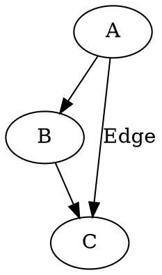
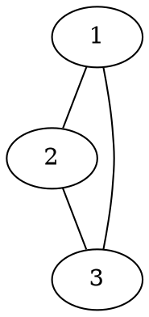
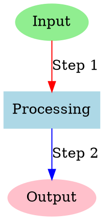
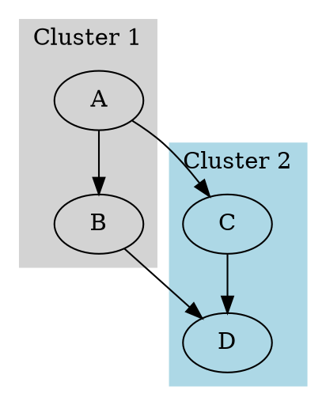
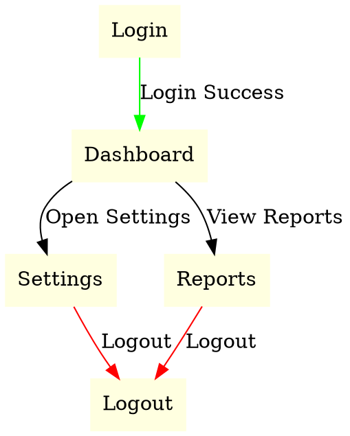

## Introduction
Graphviz is an open-source graph visualization tool that creates structured diagrams using a simple textual language called DOT. It is widely used in software engineering, network analysis, and data science to represent relationships clearly and intuitively.

## Installation & Setup
Graphviz supports installation on multiple platforms.

### Installing Graphviz
#### Windows:
1. Download the installer from [Graphviz.org](https://graphviz.org/download/).
2. Run the installer and follow the setup instructions.
3. Add Graphviz to the system PATH for command-line access.

#### macOS:
```sh
brew install graphviz
```

#### Linux (Ubuntu/Debian):
```sh
sudo apt install graphviz
```

### Installing the Python Library
For Python integration, install the `graphviz` package:
```sh
pip install graphviz
```

## Key Features
- **DOT Language**: Human-readable syntax for defining graphs.
- **Multiple Layout Engines**: Includes `dot`, `neato`, `fdp`, and `sfdp` for diverse layouts.
- **Custom Styling**: Supports various node and edge styles, colors, and shapes.
- **Flexible Output Formats**: Exports to PNG, SVG, PDF, and more.
- **Subgraphs & Clusters**: Groups nodes for better organization and clarity.

## Code Examples

### Graph Types in DOT Language
- **Directed Graphs (digraph):** Edges with direction (arrows).
- **Undirected Graphs (graph):** Edges without direction (lines).

### Basic Directed Graph



### Basic Undirected Graph



### Styling Nodes and Edges



### Graph with Subgraphs



### Complex Graph with Edge Attributes



### Using Graphviz in Python
```python
from graphviz import Digraph

dot = Digraph()
dot.edge('A', 'B')
dot.edge('B', 'C')
dot.edge('A', 'C', label="Edge")
dot.render('graph', format='png', view=True)
```


### Direct DOT Usage in Python
```python
from graphviz import Digraph

dot = Digraph(comment='Custom Graph')
dot.body = [
    'A [label="Decision", shape=diamond]',
    'B [label="Task 1", shape=box]',
    'C [label="Task 2", shape=box]',
    'D [label="End", shape=ellipse]',
    'A -> B [label="Yes"]',
    'A -> C [label="No"]',
    'B -> D',
    'C -> D'
]
dot.render('custom_graph', format='png', view=True)
```


## Use Cases

### 1. **Software Engineering**
- **Dependency Graphs**: Visualize software module relationships.
- **UML Diagrams**: Generate class hierarchies and state machines using tools like PlantUML.
- **Call Graphs**: Represent function calls within programs.

### 2. **Database & Data Science**
- **ER Diagrams**: Show table relationships in databases.
- **Data Flow Diagrams**: Illustrate data processing pipelines.
- **Neural Network Visualization**: Visualize neural network structures using frameworks like Keras.

### 3. **Networking & Infrastructure**
- **Network Topology Maps**: Display routers, switches, and server connections.
- **Cloud Architecture Diagrams**: Visualize AWS, GCP, or Azure infrastructures.

### 4. **Biology & Medicine**
- **Phylogenetic Trees**: Represent evolutionary relationships.
- **Protein Interaction Networks**: Map biochemical pathways.

### 5. **Cybersecurity**
- **Attack Trees**: Model attack vectors for threat analysis.
- **Access Control Graphs**: Visualize organizational roles and permissions.

### 6. **Social & Business Networks**
- **Organizational Hierarchies**: Represent reporting structures in companies.
- **Social Network Analysis**: Visualize relationships between individuals or groups.

### 7. **AI & NLP**
- **Knowledge Graphs**: Represent entity relationships for better reasoning.
- **Syntax Trees**: Parse and visualize sentence structures in language analysis.

### 8. **Project Management**
- **Task Dependencies**: Visualize timelines and dependencies in projects.
- **Mind Maps**: Organize brainstorming ideas visually.

## Conclusion
Graphviz simplifies visualizing complex relationships through intuitive DOT language descriptions. From workflows and data structures to network diagrams, Graphviz offers customization, flexibility, and seamless integration into various workflows, making it a vital tool for developers, data scientists, and researchers.

## References & Further Reading
- [Official Graphviz Documentation](https://graphviz.org/)
- [Graphviz Python Library](https://pypi.org/project/graphviz/)
- [Graphviz Gallery](https://graphviz.gitlab.io/gallery/)
- [Y Combinator](https://news.ycombinator.com/item?id=33327014)
- [SEP Blog Article](https://sep.com/blog/graphviz-tool-arent-using/)
- [DevTools Daily Medium](https://devtoolsdaily.medium.com/real-examples-of-graphviz-26c06c866ba5)