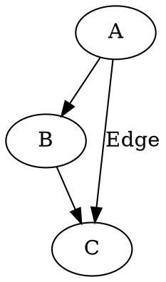
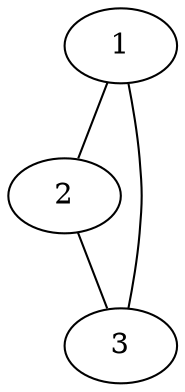
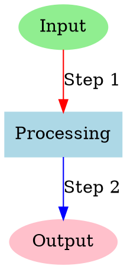
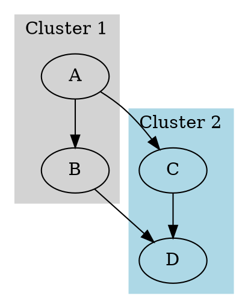
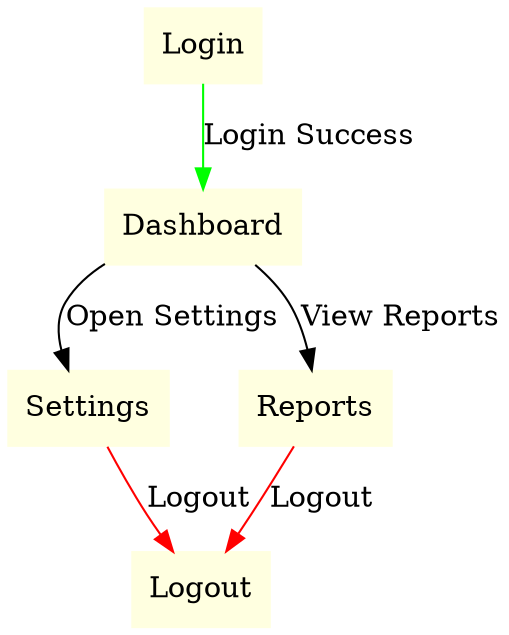

## Introduction
Graphviz is an open-source graph visualization tool that allows users to create structured diagrams using a simple textual language called DOT. It is widely used in various domains, including software engineering, network analysis, and data science, to represent relationships in an intuitive manner.

## Installation & Setup
Graphviz can be installed on multiple platforms.

### Installing Graphviz
#### Windows:
1. Download the installer from [Graphviz.org](https://graphviz.org/download/).
2. Run the installer and follow the setup instructions.
3. Add Graphviz to the system PATH for command-line usage.

#### macOS:
```sh
brew install graphviz
```

#### Linux (Ubuntu/Debian):
```sh
sudo apt install graphviz
```

### Installing the Python Library
For programmatic usage in Python, install the `graphviz` package:
```sh
pip install graphviz
```

## Key Features & Explanation
Graphviz provides the following key features:
- **DOT Language**: A simple, human-readable format for defining graphs.
- **Multiple Layout Engines**: `dot`, `neato`, `fdp`, `sfdp`, and more for different graph layouts.
- **Custom Styling**: Nodes and edges can have various styles, colors, and shapes.
- **Output Formats**: Supports PNG, SVG, PDF, and more.
- **Subgraphs & Clusters**: Allows organizing nodes into groups for clarity.

## Code Examples

Their are mainly 2 types of Graphs supported in the DOT Language:\
Directed Graphs(digraph): With directed edges (arrows).\
Undirected Graphs(graph): With undirected edges (lines)
### Basic Directed Graph Example
A simple directed graph in DOT format:



### Undirected Graph
This Graph shows a Triangle without any direction:



### Adding Styles and Colors
Customise your Nodes using different Labels, Styles, Shapes and Colors:



### Graph with Subgraphs



### Complex Graph with Edge Attributes
We can create Complex Graphs for Visualisation easily as well.



### Using Graphviz in Python
```python
from graphviz import Digraph

dot = Digraph()
dot.edge('A', 'B')
dot.edge('B', 'C')
dot.edge('A', 'C', label="Edge")
dot.render('graph', format='png', view=True)
```
This will create and display the graph using the Python Libarary.


You can also directly use Dot Language in the Python Extension if you want:
```python
from graphviz import Digraph

dot = Digraph(comment='Custom Graph')

# Put Each Line of your Dot Code in the dot.body List
dot.body = [
    'A [label="Decision", shape=diamond]',
    'B [label="Task 1", shape=box]',
    'C [label="Task 2", shape=box]',
    'D [label="End", shape=ellipse]',
    'A -> B [label="Yes"]',
    'A -> C [label="No"]',
    'B -> D',
    'C -> D'
]

dot.render('custom_graph', format='png', view=True)
```


## Use Cases
### 1. **Software Engineering & Development**

-   **Dependency Graphs**: Graphviz is utilized to visualize dependencies between software modules, libraries, or services, aiding in understanding and managing complex systems.
-   **UML Diagrams**: Tools like PlantUML leverage Graphviz to generate Unified Modeling Language diagrams, such as class hierarchies and state machines, from textual descriptions.
    
    [en.wikipedia.org](https://en.wikipedia.org/wiki/Graphviz)
    
-   **Call Graphs**: Developers use Graphviz to create call graphs that represent function calls within a program, assisting in debugging and optimization.
    
    [en.wikipedia.org](https://en.wikipedia.org/wiki/Call_graph)
    

### 2. **Database & Data Science**

-   **Entity-Relationship (ER) Diagrams**: Graphviz is employed to depict relationships between tables in a database, facilitating database design and analysis.
-   **Data Flow Diagrams**: Data scientists use Graphviz to illustrate how data moves through a system, enhancing understanding of data processing pipelines.
-   **Neural Network Visualization**: Frameworks like Keras can generate visual representations of neural network architectures using Graphviz.
    
    [graphviz.org](https://graphviz.org/gallery/)
    

### 3. **Networking & Infrastructure**

-   **Network Topology Maps**: Graphviz is used to display the connections between routers, switches, and servers, providing a clear view of network structures.
-   **Cloud Architecture Diagrams**: Engineers utilize Graphviz to visualize infrastructures on platforms like AWS, GCP, or Azure, aiding in architecture planning and documentation.

### 4. **Biology & Medicine**

-   **Phylogenetic Trees**: Researchers employ Graphviz to represent evolutionary relationships between species, aiding in the study of biological classifications.
-   **Protein Interaction Networks**: Graphviz is used to map interactions between proteins within a biological system, assisting in understanding complex biochemical pathways.

### 5. **Cybersecurity**

-   **Attack Trees**: Security professionals use Graphviz to model different attack vectors on a system, helping in threat analysis and mitigation planning.
-   **Access Control Graphs**: Graphviz assists in visualizing roles and permissions within an organization, ensuring proper access control mechanisms are in place.

### 6. **Social & Business Networks**

-   **Organizational Hierarchies**: Companies use Graphviz to represent reporting structures, clarifying roles and relationships within the organization.
-   **Social Network Analysis**: Researchers analyze relationships between individuals or groups by visualizing social networks with Graphviz.

### 7. **AI & Natural Language Processing (NLP)**

-   **Knowledge Graphs**: In AI applications, Graphviz is used to represent relationships between entities, facilitating better understanding and reasoning.
-   **Syntax Trees**: Linguists and NLP practitioners use Graphviz to parse and visualize sentence structures, aiding in language analysis.

### 8. **Project Management**

-   **Gantt Charts & Task Dependencies**: Project managers utilize Graphviz to visualize project timelines and task dependencies, enhancing planning and tracking.
-   **Mind Maps**: Graphviz is used to structure brainstorming ideas visually, aiding in organizing thoughts and concepts.

# **Conclusion**
Graphviz is a powerful tool for visualizing complex relationships through simple and intuitive graph descriptions using the DOT language. Whether you're illustrating workflows, data structures, or network diagrams, Graphviz makes it easy to create clear and informative visualizations. With its flexibility, support for customization, and seamless integration into various workflows, Graphviz is an essential tool for developers, data scientists, and researchers alike.

## References & Further Reading
- [Official Graphviz Documentation](https://graphviz.org/)
- [Graphviz Python Library](https://pypi.org/project/graphviz/)
- [Graphviz Gallery](https://graphviz.gitlab.io/gallery/)
- [Y Combinator](https://news.ycombinator.com/item?id=33327014)
- [SEP Blog Article](https://sep.com/blog/graphviz-tool-arent-using/)
- [DevTools Daily Medium](https://devtoolsdaily.medium.com/real-examples-of-graphviz-26c06c866ba5)
