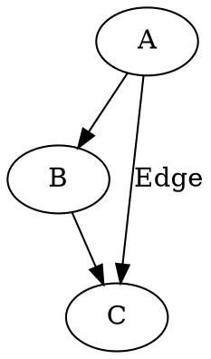
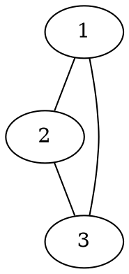
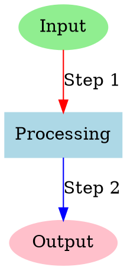
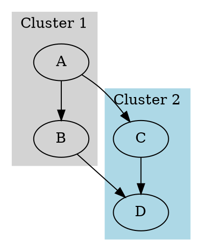
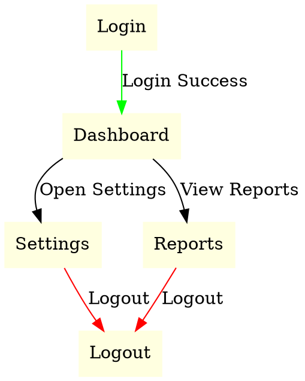

## Introduction
Graphviz is an open-source graph visualization tool that creates structured diagrams using a simple textual language called DOT. It is widely used in software engineering, network analysis, and data science to represent relationships clearly and intuitively.

## Installation & Setup
Graphviz supports installation on multiple platforms.

### Installing Graphviz
#### Windows:
1. Download the installer from [Graphviz.org](https://graphviz.org/download/).
2. Run the installer and follow the setup instructions.
3. Add Graphviz to the system PATH for command-line access.

#### macOS:
```sh
brew install graphviz
```

#### Linux (Ubuntu/Debian):
```sh
sudo apt install graphviz
```

### Installing the Python Library
For Python integration, install the `graphviz` package:
```sh
pip install graphviz
```

## Key Features
- **DOT Language**: Human-readable syntax for defining graphs.
- **Multiple Layout Engines**: Includes `dot`, `neato`, `fdp`, and `sfdp` for diverse layouts.
- **Custom Styling**: Supports various node and edge styles, colors, and shapes.
- **Flexible Output Formats**: Exports to PNG, SVG, PDF, and more.
- **Subgraphs & Clusters**: Groups nodes for better organization and clarity.

## Advanced Features  

### 1. Graph Attributes  
- **Graph Rank Management**: Use `rankdir` to control graph direction (e.g., left-to-right).  
- **Rank Constraints**: Control node alignment with `rank` and `group` attributes.  

### 2. Layout Customization  
- **Custom Layout Engines**: Use specialized engines like `twopi`, `circo`, or `osage` for unique visualizations.  
- **Edge Routing**: Customize edge paths using splines, orthogonal routing, or straight lines.  

### 3. Interactivity & Animation  
- **Interactive Outputs**: Export to interactive formats like SVG with clickable nodes and edges.  
- **Dynamic Graph Updates**: Integrate with web frameworks (e.g., D3.js) for real-time updates.  

### 4. Clustering & Hierarchies  
- **Nested Clusters**: Create multi-level clusters for complex hierarchical data.  
- **Cross-Cluster Connections**: Customize how nodes across clusters interact.  

### 5. Integration & Automation  
- **Pipeline Integration**: Use Graphviz in CI/CD pipelines for visualizing workflows and dependencies.  

### 6. Performance Optimization  
- **Large Graph Handling**: Optimize rendering using `concentrate`, `simplify`, or adjusting engine parameters.  
- **Incremental Rendering**: Render parts of large graphs for performance gains.  

### 7. Accessibility & Localization  
- **Accessible Graphs**: Add titles, descriptions, and alternative texts for accessibility compliance.  
- **Localization Support**: Use Unicode and language-specific fonts for internationalization.  

### 8. Advanced Styling  
- **Gradient Fills & Transparency**: Enhance visuals with gradients and alpha transparency.  
- **Custom Shapes & Images**: Embed images or define custom node shapes.  

### 9. Export Customization  
- **Advanced Export Formats**: Export to LaTeX (`TikZ`), JSON, or interactive HTML.  
- **Post-Processing**: Use Graphviz output with vector graphic tools for further customization.  

## Code Examples

### Graph Types in DOT Language
- **Directed Graphs (digraph):** Edges with direction (arrows).
- **Undirected Graphs (graph):** Edges without direction (lines).

### Basic Directed Graph



### Basic Undirected Graph



### Styling Nodes and Edges



### Graph with Subgraphs



### Complex Graph with Edge Attributes



### Using Graphviz in Python
```python
from graphviz import Digraph

dot = Digraph()
dot.edge('A', 'B')
dot.edge('B', 'C')
dot.edge('A', 'C', label="Edge")
dot.render('graph', format='png', view=True)
```


### Direct DOT Usage in Python
```python
from graphviz import Digraph

dot = Digraph(comment='Custom Graph')
dot.body = [
    'A [label="Decision", shape=diamond]',
    'B [label="Task 1", shape=box]',
    'C [label="Task 2", shape=box]',
    'D [label="End", shape=ellipse]',
    'A -> B [label="Yes"]',
    'A -> C [label="No"]',
    'B -> D',
    'C -> D'
]
dot.render('custom_graph', format='png', view=True)
```


## Use Cases

### 1. **Software Engineering**
- **Dependency Graphs**: Visualize software module relationships.
- **UML Diagrams**: Generate class hierarchies and state machines using tools like PlantUML.
- **Call Graphs**: Represent function calls within programs.

### 2. **Database & Data Science**
- **ER Diagrams**: Show table relationships in databases.
- **Data Flow Diagrams**: Illustrate data processing pipelines.
- **Neural Network Visualization**: Visualize neural network structures using frameworks like Keras.

### 3. **Networking & Infrastructure**
- **Network Topology Maps**: Display routers, switches, and server connections.
- **Cloud Architecture Diagrams**: Visualize AWS, GCP, or Azure infrastructures.

### 4. **Biology & Medicine**
- **Phylogenetic Trees**: Represent evolutionary relationships.
- **Protein Interaction Networks**: Map biochemical pathways.

### 5. **Cybersecurity**
- **Attack Trees**: Model attack vectors for threat analysis.
- **Access Control Graphs**: Visualize organizational roles and permissions.

### 6. **Social & Business Networks**
- **Organizational Hierarchies**: Represent reporting structures in companies.
- **Social Network Analysis**: Visualize relationships between individuals or groups.

### 7. **AI & NLP**
- **Knowledge Graphs**: Represent entity relationships for better reasoning.
- **Syntax Trees**: Parse and visualize sentence structures in language analysis.

### 8. **Project Management**
- **Task Dependencies**: Visualize timelines and dependencies in projects.
- **Mind Maps**: Organize brainstorming ideas visually.

## Tool Comparisons
Graphviz is powerful, but several other graph visualization tools cater to different needs. Here's how it compares:

| Tool        | Key Features                         | Pros                                | Cons                                | Best For                    |
|-------------|--------------------------------------|-------------------------------------|-------------------------------------|------------------------------|
| **Graphviz**| Text-based DOT language, flexible output formats, multiple layout engines | Lightweight, highly customizable, integrates well with Python | Steep learning curve for beginners, lacks interactivity | Static graph generation, software engineering diagrams |
| **Gephi**   | Interactive visualizations, drag-and-drop interface, network statistics    | Great for large networks, interactive, real-time manipulation | Resource-intensive, GUI-focused | Social network analysis, exploratory data analysis |
| **Cytoscape**| Specialized in biological data, plugin support | Excellent for biological networks, highly extensible | Niche focus, heavier application | Bioinformatics, molecular networks |
| **NetworkX**| Python-based, integrates with Matplotlib | Fully programmable in Python, flexible | Less efficient for very large graphs, no built-in GUI | Algorithm analysis, network science research |
| **D3.js**   | JavaScript-based, interactive web visualizations | Interactive and dynamic, web-friendly | Requires JavaScript knowledge, complex setup | Web-based interactive graphs, data journalism |

## Conclusion
Graphviz simplifies visualizing complex relationships through intuitive DOT language descriptions. From workflows and data structures to network diagrams, Graphviz offers customization, flexibility, and seamless integration into various workflows, making it a vital tool for developers, data scientists, and researchers.

## References & Further Reading
- [Official Graphviz Documentation](https://graphviz.org/)
- [Graphviz Python Library](https://pypi.org/project/graphviz/)
- [Graphviz Gallery](https://graphviz.gitlab.io/gallery/)
- [Graphviz Python Library Documentation](https://graphviz.readthedocs.io/en/stable/manual.html)
- [Y Combinator](https://news.ycombinator.com/item?id=33327014)
- [SEP Blog Article](https://sep.com/blog/graphviz-tool-arent-using/)
- [DevTools Daily Medium](https://devtoolsdaily.medium.com/real-examples-of-graphviz-26c06c866ba5)
- [TikZ Manual For Advanced LaTeX Visualization with Graphviz](https://tikz.dev/)